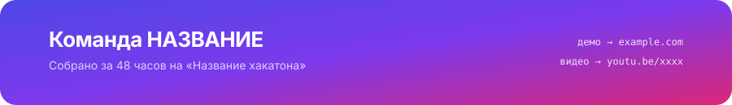

<!-- ═════════════════════ ШАПКА ═════════════════════
     Шапка и футер — локальные файлы docs/header.svg и docs/footer.svg.
     Внутри: переливающийся градиент + бегущий питч (боль → решение → эффект).
     Текст питча правится прямо в SVG обычными буквами.

     ПАЛИТРА ПРОЕКТА:
       4F46E5 индиго · 7C3AED фиолетовый · DB2777 малиновый
     Растяжка для бейджей (равные шаги):
       4F46E5 · 6141E8 · 733CEB · 8F36D5 · B52FA6 · DB2777
     ══════════════════════════════════════════════════ -->

<div align="center">



<br/><br/>

[](URL)
[](URL)
[](URL)

<!-- СТРОКА СОСТОЯНИЯ — читается как приборная панель живого продукта -->


<br/>


</div>

<!-- ПРАВИЛА ФАЙЛА
     1. Гифка выше — главный элемент. 10–15 сек, один сквозной сценарий.
     2. Длинное прячется в <details>: суть видна, детали доступны.
     3. Каждый абзац отвечает на вопрос жюри. Не отвечает — удалить. -->

<br/>

## Проблема

**{Роль}** тратит **{цифра}** на **{операция}**.

{Одно предложение: почему так происходит сейчас.}

## Что мы сделали

```diff
- Ручная сверка обращений — 40 секунд каждое, 217 раз за смену
+ Автоматическое склеивание дублей — 0.2 секунды, без участия человека
```

|  | Было | Стало |
|---|---|---|
| **{Ключевая метрика}** | {знач.} | **{знач.}** |
| **{Вторая метрика}** | {знач.} | **{знач.}** |
| **{Третья}** | {знач.} | **{знач.}** |

{За счёт чего получен результат. Не «мы применили ИИ», а конкретный механизм.}

<br/>

## Возможности

<table>
<tr>
<td width="50%">

**{Фича 1}**
{Что даёт пользователю}

</td>
<td width="50%">

**{Фича 2}**
{Что даёт пользователю}

</td>
</tr>
<tr>
<td width="50%">

**{Фича 3}**
{Что даёт пользователю}

</td>
<td width="50%">

**{Фича 4}**
{Что даёт пользователю}

</td>
</tr>
</table>

<br/>

## Как устроено

<!-- Две версии схемы. GitHub подставит нужную под тему смотрящего. -->
<div align="center">
<picture>
  <source media="(prefers-color-scheme: dark)"  srcset="docs/architecture-dark.png">
  <source media="(prefers-color-scheme: light)" srcset="docs/architecture-light.png">
  
</picture>
</div>

**Ключевое решение:** {то, чем гордитесь технически. Какую альтернативу рассматривали и почему отказались. Сюда придёт первый вопрос жюри — ответ пишется заранее.}

<br/>

## Стек

<div align="center">

<!-- Ряд 1: инструменты. Иконки единообразные, поэтому фирменные бейджи здесь лишние. -->


<br/><br/>

<!-- Ряд 2: что именно делает система. Цвета по растяжке слева направо —
     строка читается как один объект, а не набор наклеек. -->


<br/>

<!-- Ряд 3: библиотеки с логотипами, та же растяжка -->


</div>

<br/>

## Запуск

```bash
git clone URL && cd REPO
cp .env.example .env
make up
```

→ http://localhost:3000 · API: http://localhost:8000/docs

Нужен только Docker. Проверено на чистой машине.

<details>
<summary><b>Переменные окружения, команды, запуск без Docker</b></summary>

<br/>

| Переменная | Зачем | Обязательна |
|---|---|---|
| `VAR` | назначение | да |
| `VAR` | назначение | нет |

```bash
make seed      # демо-данные
make eval      # воспроизвести замер метрик
make lint      # проверки
make down      # остановить
```

Без Docker:

```bash
cd backend  && uv sync && uv run uvicorn app.main:app --reload
cd frontend && pnpm i  && pnpm dev
```

</details>

<details>
<summary><b>Структура репозитория</b></summary>

<br/>

```
backend/
  app/api/       роуты FastAPI
  app/core/      бизнес-логика
  app/ml/        модели и инференс
frontend/
  app/           App Router
  components/    UI
docs/            схемы, гифки, презентация
```

</details>

<br/>

## Что дальше

- **{Пункт}** — что нужно для внедрения в прод
- **{Пункт}** — ограничение прототипа и как снимается
- **{Пункт}** — как масштабируется на объёмы заказчика

<br/>

<div align="center">

**{Имя}** · Backend / ML · [@tg](URL) &nbsp;·&nbsp; **{Имя}** · Frontend · [@tg](URL) &nbsp;·&nbsp; **{Имя}** · Аналитика · [@tg](URL)

</div>

